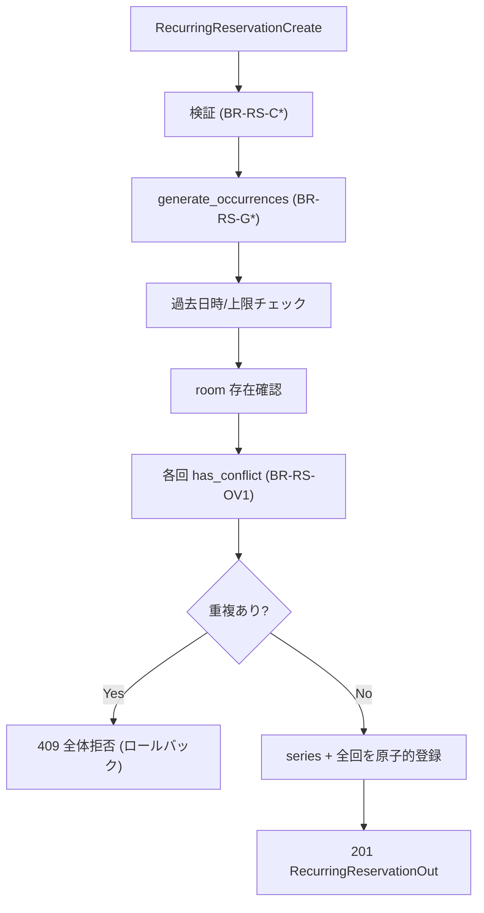

# Business Logic Model — recurring-reservations

技術非依存の業務ロジック。詳細ルールは business-rules.md（BR-RS*）参照。

## 1. 週次生成ロジック（recurrence — 純粋関数）

### generate_occurrences(start_time, end_time, count, until, max_count=52)
```
前提: (start_time, end_time, ちょうど count か until の一方)
手順:
  occurrences = []
  if count is not None:
      n = count
      for i in 0..n-1:
          occurrences.append((start_time + 7*i 日, end_time + 7*i 日))
  else:  # until 指定（date, inclusive）
      i = 0
      loop:
          occ_start = start_time + 7*i 日
          if occ_start.date() > until: break
          occurrences.append((occ_start, end_time + 7*i 日))
          i += 1
  return occurrences
検証（呼び出し側 service）:
  - len(occurrences) == 0  -> ValidationError(400)   # until が起点より前 等
  - len(occurrences) > max_count -> ValidationError(400)  # BR-RS-C7
特性:
  - 純粋関数（DB 非依存、datetime のみ）
  - 各回は7日刻み、時刻部分は起点と同一
```

**Testable Properties（PBT-01, Partial では助言）**
- Invariant: `count` 指定時、`len(result) == count`（0 < count <= 52）。
- Invariant: 連続する回の開始差 == 7日（同一時刻）。
- Invariant: `until` 指定時、全回の `start.date() <= until` かつ 次の回は `> until`。

## 2. シリーズ作成オーケストレーション（RecurringReservationService.create_series）

```
1. 検証:
   - start_time < end_time                     (BR-RS-C1)
   - booker_name 非空                           (BR-RS-C2)
   - (count, until) のちょうど一方              (BR-RS-C4)
2. occurrences = generate_occurrences(...)      (BR-RS-G*)
   - 0 件 or 上限超過 -> 400                     (BR-RS-C6/C7)
3. occurrences[0].start >= now                  (BR-RS-C8) 過去なら 400
4. room 存在確認 -> なければ 404                 (BR-RS-C3)
5. for each occ in occurrences:                 (BR-RS-OV1)
       if availability.has_conflict(room_id, occ.start, occ.end): conflict=True; break
   if conflict: -> 409（全体拒否, 何も登録しない） (BR-RS-OV2)
6. series = ReservationSeries(...)              作成
   reservations = [Reservation(series_id=series.id, status=active, ...) for occ]
   単一トランザクションで series + 全 reservations を add & commit  (BR-RS-OV4)
7. return series + reservations -> 201           (BR-RS-R1)
```

### データフロー


## 3. シリーズ全体キャンセル（cancel_series）

```
1. series = SeriesRepository.get(series_id); なければ 404   (BR-RS-X4)
2. now = datetime.now()
3. future_active = reservations で series_id 一致 かつ status==active かつ start_time > now  (BR-RS-X1)
4. for r in future_active: r.status = cancelled
5. commit（未来 active 回が無ければ変更なし = 冪等）           (BR-RS-X2/X3)
6. return series + occurrences -> 200                        (BR-RS-X5)
```

## 4. シリーズ照会（get_series — US-R07）

```
1. series = SeriesRepository.get(series_id); なければ 404
2. occurrences = reservations で series_id 一致（全件）
3. return series + occurrences -> 200
```

## 5. 個別回キャンセル（既存流用）

新規ロジックなし。既存 `ReservationService.cancel_reservation` を使用（BR-RS-I1）。

## 既存ロジックとの整合

- 重複判定は `overlaps` / `has_conflict` を変更せず再利用（C-2）。
- 過去日時・時刻順序・予約者名の検証方針は既存単発と一貫（BR-C* に対応）。
- キャンセルの冪等性は既存 BR-X3 と同方針。
