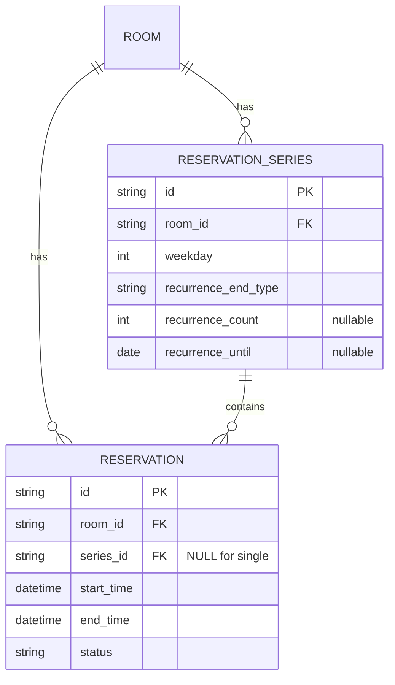

# Domain Entities — recurring-reservations

## Entity: ReservationSeries（新規）

シリーズのメタ情報。1シリーズ = 週次で生成された複数の Reservation の親。

| Field | Type | Nullable | 説明 |
|---|---|---|---|
| id | str (UUID, 36) | No (PK) | シリーズ識別子 |
| room_id | str (36, FK rooms.id) | No | 対象会議室 |
| booker_name | str | No | 予約者名（全回共通） |
| booker_email | str | Yes | 予約者メール（任意） |
| weekday | int (0-6) | No | 繰り返し曜日（起点の曜日。Python `weekday()` 準拠, 月=0） |
| start_time | datetime | No | 起点（1回目）の開始日時。時刻部分が各回の開始時刻を規定 |
| end_time | datetime | No | 起点（1回目）の終了日時。時刻部分が各回の終了時刻を規定 |
| recurrence_end_type | str ("count" \| "until") | No | 終了条件の種別 |
| recurrence_count | int | Yes | count 指定時の回数（until 指定時は NULL） |
| recurrence_until | date | Yes | until 指定時の終了日（count 指定時は NULL） |
| occurrence_count | int | No | 実際に生成された回数（監査・照会用） |
| created_at | datetime | No | 作成日時 |

- **関係**: ReservationSeries 1 — * Reservation（`reservations.series_id`）。
- **備考**: weekday は start_time から導出可能な冗長情報だが、照会時の可読性のため保持（Functional Design 判断。実装で省略可）。

## Entity: Reservation（変更）

既存エンティティに列を1つ追加。既存フィールドは不変。

| Field | Type | Nullable | 説明 |
|---|---|---|---|
| id | str (UUID) | No (PK) | （既存） |
| room_id | str (FK) | No | （既存） |
| start_time | datetime | No | （既存）当該回の開始 |
| end_time | datetime | No | （既存）当該回の終了 |
| booker_name | str | No | （既存） |
| booker_email | str | Yes | （既存） |
| status | str (active/cancelled) | No | （既存） |
| created_at | datetime | No | （既存） |
| **series_id** | **str (36, FK reservation_series.id)** | **Yes** | **新規。シリーズ所属。単発予約は NULL** |

- **単発予約**: `series_id = NULL`（既存の作成フローは series_id を設定しない → 自動的に NULL）。
- **シリーズの各回**: 同一 `series_id` を持つ通常の Reservation 行。既存のキャンセル/照会 API がそのまま機能する。

## Entity Relationship

## Testable Properties（PBT-01, Partial モードでは助言）
- **ReservationSeries ↔ occurrences 不変**: 生成された Reservation の件数 == `occurrence_count`。
- **series_id 一貫性**: 1シリーズ内の全 Reservation は同一 series_id を持つ（Invariant）。
