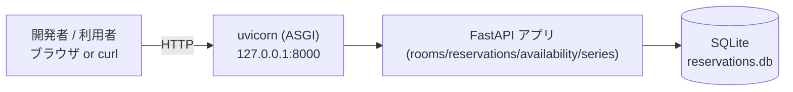

# Deployment Architecture — recurring-reservations

## デプロイ構成（ローカル単一プロセス）

## 構成要素

| 要素 | 実体 | 変更 |
|---|---|---|
| ランタイム | Python 3.13 | 既存 |
| アプリサーバ | uvicorn[standard] | 既存 |
| アプリ | FastAPI（series ルータ追加） | 変更（router 登録） |
| データストア | SQLite ファイル | 変更（テーブル/列追加） |
| 依存 | requirements.txt に hypothesis 追加 | 変更（テスト依存） |

## 起動シーケンス
1. `app.main` インポート時に `create_all()` を実行:
   - `reservation_series` テーブル作成（未作成なら）。
   - `reservations.series_id` 列追加（無ければ、冪等 ALTER ヘルパ）。
2. `create_app()` で rooms/reservations/availability/**series** ルータと例外ハンドラを登録。
3. uvicorn がリクエストを受け付け。

## 環境変数（既存踏襲）
- `DATABASE_URL`（既定 `sqlite:///./reservations.db`）、`HOST`、`PORT`。追加の環境変数なし。

## ロールバック
- `app/series/` 削除・`main` の series ルータ登録解除でアプリ側は復旧。
- DB は `series_id` 列/`reservation_series` テーブルが残るが、単発フローは `series_id=NULL` で正常動作するため実害なし（必要なら列/テーブル破棄）。

## CI（Build and Test で詳細化）
- `pytest` 実行（既存 + 新規 + PBT）。Hypothesis の seed をログ。
