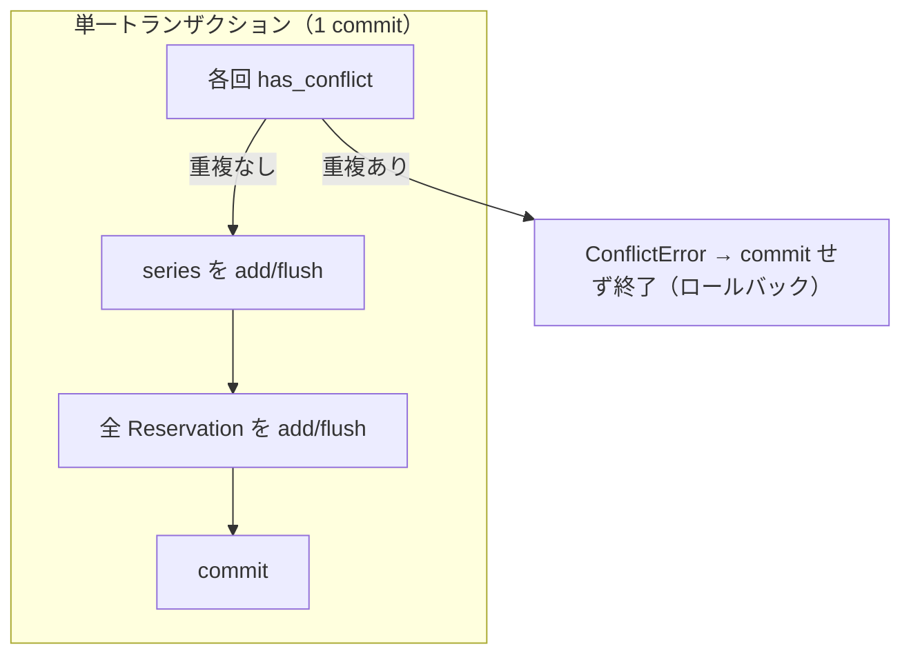

# Logical Components — recurring-reservations

追加インフラコンポーネント（キュー・キャッシュ・サーキットブレーカ等）は導入しない。論理コンポーネントは既存レイヤードアーキテクチャの拡張のみ。

## 論理コンポーネントと責務境界

| 論理コンポーネント | 物理実装 | 責務 | NFR 対応 |
|---|---|---|---|
| Recurring API Boundary | app/series/router.py | HTTP 入出力、依存性注入 | P-4 |
| Recurring Orchestrator | app/series/service.py | 検証・生成・重複・原子的登録・キャンセル | P-1, P-3, P-5 |
| Recurrence Core (pure) | app/series/recurrence.py | 週次生成・終了条件解決（副作用なし） | P-3, P-6 |
| Series Persistence | app/series/repository.py | reservation_series の CRUD | P-1 |
| Reservation Persistence (ext) | app/reservations/repository.py | series_id 検索メソッド追加 | P-1 |
| Conflict Kernel (reuse) | app/availability/service.py | 半開区間の重複判定（不変） | P-5 |
| Error Mapping (reuse) | app/common/errors.py | 例外→HTTP | P-4 |
| Persistence Session (reuse) | app/db/database.py | セッション・トランザクション境界・テーブル作成 | P-1 |

## トランザクション境界

## データ整合性の担保
- **書き込み境界**: create_series は1回の commit のみ。cancel_series も1回の commit。
- **読み取り**: get_series / list は既存の読み取りパターン（session.query）を使用。
- **同時実行**: SQLite の既定分離レベルに依存。小規模・低同時実行前提のため追加のロック機構は導入しない（スコープ外、NFR-RS-5）。

## 可観測性
- 既存同様、専用のメトリクス/ログ基盤は導入しない（Resiliency 拡張無効）。エラーは HTTP ステータスと detail メッセージで表現。
