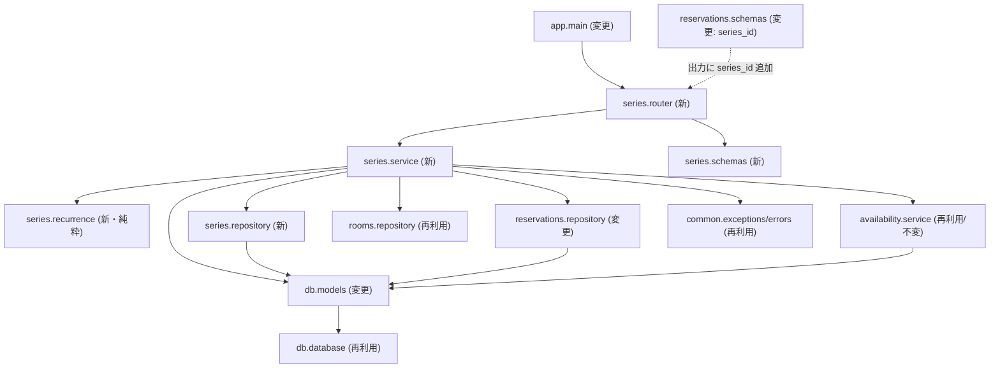
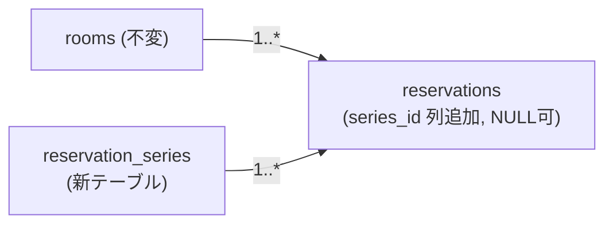

# Component Dependency — 定期予約機能

## 依存マトリクス

| コンポーネント | 依存先 | 種別 |
|---|---|---|
| app.series.router | app.series.service, app.series.schemas, db.database(get_db) | Runtime |
| app.series.service | app.series.recurrence, app.series.repository, reservations.repository, rooms.repository, availability.service, common.exceptions, db.models | Runtime |
| app.series.recurrence | （標準ライブラリ datetime のみ） | Runtime |
| app.series.repository | db.models, SQLAlchemy Session | Runtime |
| app.series.schemas | pydantic | Runtime |
| app.reservations.schemas (変更) | pydantic（series_id 追加のみ） | Runtime |
| app.reservations.repository (変更) | db.models（メソッド追加） | Runtime |
| app.db.models (変更) | db.database(Base)（ReservationSeries 追加、series_id 列） | Runtime |
| app.main (変更) | app.series.router（登録追加） | Runtime |

## 通信パターン

- すべて同一プロセス内の直接メソッド呼び出し（既存アーキテクチャ踏襲）。
- レイヤー: series.router → series.service → {recurrence(pure), repositories, availability.service} → db.models → db.database → SQLite。
- 例外は下位でドメイン例外として送出し、`common.errors` の FastAPI ハンドラで HTTP に変換（既存の仕組みを流用）。

## 依存グラフ

## データフロー（新テーブル/列）

## 影響範囲と後方互換

- **後方互換**: `ReservationCreate`（リクエスト）不変。`ReservationOut` は `series_id` 追加のみ（既存クライアント・既存テストは個別フィールド検証のため非破壊）。
- **DB マイグレーション**: 新テーブル追加は `create_all` で対応。既存 `reservations` への `series_id` 列追加は Infrastructure Design で手順を確定（新規DBは create_all、既存DBは ALTER 手順）。
- **半開区間ロジック**: availability.service を変更しないことで C-2 を保証。
