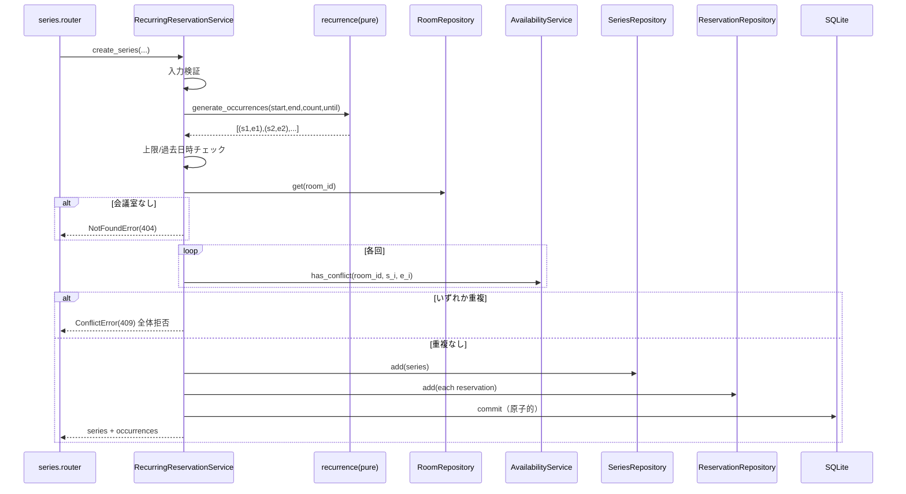

# Services — 定期予約機能

## RecurringReservationService（新規、中核オーケストレータ）

### 責務
シリーズ関連ユースケースの調整。HTTP 非依存（ドメイン例外を送出）。

### オーケストレーション: シリーズ作成
1. 入力検証（start<end、booker_name、終了条件の一方指定、count/until 妥当性）。違反は ValidationError(400)。
2. `recurrence.generate_occurrences` で全回 (start,end) を生成。上限(52)超過は ValidationError(400)。
3. 最初の回の開始が過去なら ValidationError(400)（既存単発ルールと一貫）。
4. `RoomRepository.get` で会議室存在確認。未存在は NotFoundError(404)。
5. 各回について `AvailabilityService.has_conflict` を評価。**1回でも True なら ConflictError(409)**（全体拒否、原子性）。
6. `ReservationSeries` と全 `Reservation`（同一 series_id、status=active）を生成し、**単一トランザクションで commit**。
7. 生成された series と全回を返す（router が 201 で RecurringReservationOut に整形）。

### オーケストレーション: シリーズ全体キャンセル
1. `SeriesRepository.get` で series 存在確認。未存在は NotFoundError(404)。
2. `ReservationRepository.list_future_active_by_series(series_id, now)` で未来の active 回を取得。
3. 各回を cancelled に更新（既に無ければ状態変化なし＝冪等）。commit。
4. series と各回状態を返す（router が 200 で SeriesOut に整形）。

### オーケストレーション: シリーズ照会（任意 US-R07）
1. series と全回を取得。未存在は NotFoundError(404)。

## 再利用サービス

### AvailabilityService（変更なし）
- **利用メソッド**: `has_conflict(room_id, start, end)`。半開区間ロジックを各回にそのまま適用。
- **重要**: このサービスは一切変更しない（C-2）。

### RoomService / ReservationService（変更なし）
- ReservationService は個別回キャンセル（既存 `cancel_reservation`）を通じてシリーズ各回のキャンセルにそのまま機能（US-R05）。追加変更不要。

## サービス間相互作用（シリーズ作成）

