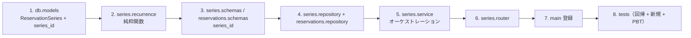

# Unit of Work Dependency — 定期予約機能

## ユニット構成
単一ユニット `recurring-reservations` のため、ユニット間依存は存在しない。以下はユニット内部および既存モジュールへの依存を示す。

## ユニット→既存モジュール依存マトリクス

| 依存元（ユニット内） | 依存先（既存/共有） | 種別 | 変更有無 |
|---|---|---|---|
| series.service | availability.service（has_conflict） | Runtime | 既存・不変（再利用） |
| series.service | rooms.repository（get） | Runtime | 既存・不変 |
| series.service | reservations.repository（series 検索メソッド） | Runtime | 変更（メソッド追加） |
| series.service | common.exceptions | Runtime | 既存・不変 |
| series.service | db.models（ReservationSeries, Reservation） | Runtime | 変更（モデル追加/列追加） |
| series.repository | db.models | Runtime | 変更 |
| series.router | db.database（get_db） | Runtime | 既存・不変 |
| main | series.router | Runtime | 変更（登録追加） |
| reservations.schemas(ReservationOut) | — | — | 変更（series_id 追加） |

## 実装順序（クリティカルパス）



### テキスト代替
```
1. db.models（ReservationSeries + Reservation.series_id）
2. series.recurrence（純粋関数）
3. schemas（series + ReservationOut.series_id）
4. repositories（SeriesRepository + reservations 検索メソッド）
5. series.service（オーケストレーション）
6. series.router
7. main（router 登録）
8. tests（既存回帰 + 新規 + PBT）
```

## コーディネーションポイント
- `AvailabilityService.has_conflict` のシグネチャ（再利用インターフェース、変更しない）。
- `ReservationOut` の後方互換拡張（series_id は Optional、既存クライアント非破壊）。
- 新テーブル作成方式（`create_all`）と既存DBへの列追加（Infrastructure Design で確定）。

## ロールバック戦略
- 追加中心のため、`app/series/` 削除・`main` 登録解除・`series_id` 列/テーブルの破棄で復旧可能。既存機能への影響は最小。
