# Execution Plan — 定期予約機能

## Detailed Analysis Summary

### Transformation Scope (Brownfield)
- **Transformation Type**: Single application（既存 FastAPI モノリス内への機能追加。インフラ・デプロイモデルの変更なし）
- **Primary Changes**: 新規エンドポイント群（`POST /reservations/recurring`、`POST /reservations/recurring/{series_id}/cancel`、任意で `GET /reservations/recurring/{series_id}`）、新テーブル `reservation_series`、`reservations.series_id` 列追加、週次日付生成ロジック、既存重複判定（`AvailabilityService`）の再利用。
- **Related Components**: reservations（router/service/schemas/repository）、db.models、db.database（テーブル作成）、availability.service（再利用）、tests。

### Change Impact Assessment
- **User-facing changes**: Yes — 新しい定期予約 API 群。既存単発 API の利用体験は不変。
- **Structural changes**: No — アーキテクチャ（レイヤード構成）は維持。新規シリーズモジュール/テーブルを既存構造に沿って追加。
- **Data model changes**: Yes — 新テーブル `reservation_series`、`reservations` への `series_id`（NULL可・FK）列追加。
- **API changes**: Yes（追加のみ）— 新規エンドポイント追加、`ReservationOut` に `series_id` を後方互換で追加。既存リクエスト契約は不変（C-1）。
- **NFR impact**: Yes — 原子的トランザクション（NFR-2）、PBT Partial（日付生成・重複判定・シリアライズ往復）。

### Component Relationships (Brownfield)
- **Primary Component**: `app.reservations`（新規シリーズ機能の中心）
- **Shared Components (再利用)**: `app.availability`（重複判定 — 変更せず利用）、`app.common`（例外/HTTP マッピング）、`app.db`（モデル/セッション）
- **Dependent Components**: `app.main`（新 router 登録）、`app.availability`（`find_available_rooms` はシリーズ回も active 予約として自然に考慮）
- **Test Package**: `tests`（新規テスト追加。既存テストは不変 — C-4）

| Component | Change Type | Change Reason | Priority |
|---|---|---|---|
| app.db.models | Minor | series テーブル・series_id 列追加 | Critical |
| app.reservations.* | Major | 新規シリーズ作成/キャンセル/照会ロジック | Critical |
| app.reservations.schemas | Minor | Recurring 入出力 + ReservationOut に series_id | Critical |
| app.main | Config | 新 router 登録 | Important |
| app.availability | None（再利用） | 重複判定を流用 | — |
| tests | Minor | 新規テスト追加（既存不変） | Important |

### Risk Assessment
- **Risk Level**: Medium — 複数コンポーネント・データモデル変更を伴うが、既存の半開区間ロジックを再利用でき、変更は追加中心で後方互換。
- **Rollback Complexity**: Moderate — 新テーブル/列とエンドポイント追加が中心。単発機能への影響は最小。
- **Testing Complexity**: Moderate — 境界条件（重複=全体拒否の原子性、未来回のみキャンセル、回数上限、冪等性）+ PBT。

## Workflow Visualization

```mermaid
flowchart TD
    Start(["User Request"])

    subgraph INCEPTION["INCEPTION PHASE"]
        WD["Workspace Detection<br/><b>COMPLETED</b>"]
        RE["Reverse Engineering<br/><b>COMPLETED</b>"]
        RA["Requirements Analysis<br/><b>COMPLETED</b>"]
        US["User Stories<br/><b>COMPLETED</b>"]
        WP["Workflow Planning<br/><b>IN PROGRESS</b>"]
        AD["Application Design<br/><b>EXECUTE</b>"]
        UG["Units Generation<br/><b>EXECUTE</b>"]
    end

    subgraph CONSTRUCTION["CONSTRUCTION PHASE"]
        FD["Functional Design<br/><b>EXECUTE</b>"]
        NFRA["NFR Requirements<br/><b>EXECUTE</b>"]
        NFRD["NFR Design<br/><b>EXECUTE</b>"]
        ID["Infrastructure Design<br/><b>EXECUTE</b>"]
        CG["Code Generation<br/><b>EXECUTE</b>"]
        BT["Build and Test<br/><b>EXECUTE</b>"]
    end

    subgraph OPERATIONS["OPERATIONS PHASE"]
        OPS["Operations<br/><b>PLACEHOLDER</b>"]
    end

    Start --> WD
    WD --> RE --> RA --> US --> WP
    WP --> AD --> UG
    UG --> FD --> NFRA --> NFRD --> ID --> CG --> BT
    BT --> OPS
    BT --> End(["Complete"])

    style WD fill:#4CAF50,stroke:#1B5E20,stroke-width:3px,color:#fff
    style RE fill:#4CAF50,stroke:#1B5E20,stroke-width:3px,color:#fff
    style RA fill:#4CAF50,stroke:#1B5E20,stroke-width:3px,color:#fff
    style US fill:#4CAF50,stroke:#1B5E20,stroke-width:3px,color:#fff
    style WP fill:#4CAF50,stroke:#1B5E20,stroke-width:3px,color:#fff
    style AD fill:#FFA726,stroke:#E65100,stroke-width:3px,stroke-dasharray: 5 5,color:#000
    style UG fill:#FFA726,stroke:#E65100,stroke-width:3px,stroke-dasharray: 5 5,color:#000
    style FD fill:#FFA726,stroke:#E65100,stroke-width:3px,stroke-dasharray: 5 5,color:#000
    style NFRA fill:#FFA726,stroke:#E65100,stroke-width:3px,stroke-dasharray: 5 5,color:#000
    style NFRD fill:#FFA726,stroke:#E65100,stroke-width:3px,stroke-dasharray: 5 5,color:#000
    style ID fill:#FFA726,stroke:#E65100,stroke-width:3px,stroke-dasharray: 5 5,color:#000
    style CG fill:#4CAF50,stroke:#1B5E20,stroke-width:3px,color:#fff
    style BT fill:#4CAF50,stroke:#1B5E20,stroke-width:3px,color:#fff
    style OPS fill:#BDBDBD,stroke:#424242,stroke-width:2px,stroke-dasharray: 5 5,color:#000
    style INCEPTION fill:#BBDEFB,stroke:#1565C0,stroke-width:3px,color:#000
    style CONSTRUCTION fill:#C8E6C9,stroke:#2E7D32,stroke-width:3px,color:#000
    style OPERATIONS fill:#FFF59D,stroke:#F57F17,stroke-width:3px,color:#000
    style Start fill:#CE93D8,stroke:#6A1B9A,stroke-width:3px,color:#000
    style End fill:#CE93D8,stroke:#6A1B9A,stroke-width:3px,color:#000

    linkStyle default stroke:#333,stroke-width:2px
```



### Text Alternative（Mermaid フォールバック）
```
INCEPTION:
- Workspace Detection: COMPLETED
- Reverse Engineering: COMPLETED
- Requirements Analysis: COMPLETED
- User Stories: COMPLETED
- Workflow Planning: IN PROGRESS
- Application Design: EXECUTE
- Units Generation: EXECUTE
CONSTRUCTION:
- Functional Design: EXECUTE
- NFR Requirements: EXECUTE
- NFR Design: EXECUTE
- Infrastructure Design: EXECUTE
- Code Generation: EXECUTE
- Build and Test: EXECUTE
OPERATIONS:
- Operations: PLACEHOLDER
```

## Phases to Execute

### 🔵 INCEPTION PHASE
- [x] Workspace Detection (COMPLETED)
- [x] Reverse Engineering (COMPLETED)
- [x] Requirements Analysis (COMPLETED)
- [x] User Stories (COMPLETED)
- [x] Workflow Planning (IN PROGRESS)
- [ ] Application Design - **EXECUTE**
  - **Rationale**: 新規シリーズ機能のコンポーネント/メソッド/業務ルール（週次生成・全体拒否・未来回キャンセル）を定義する必要がある。ワークショップ方針で全工程実施。
- [ ] Units Generation - **EXECUTE**
  - **Rationale**: 新データモデル・新エンドポイント・複数コンポーネント変更があり、作業単位への分解が有効。ワークショップ方針で全工程実施。

### 🟢 CONSTRUCTION PHASE
- [ ] Functional Design - **EXECUTE**
  - **Rationale**: 新データモデル（series）と週次生成・終了条件解決・原子的重複処理という業務ロジックの詳細設計が必要。PBT-01 の property 識別もここで実施。
- [ ] NFR Requirements - **EXECUTE**
  - **Rationale**: 原子性・後方互換・PBT フレームワーク選定（PBT-09、Hypothesis）を確定する。
- [ ] NFR Design - **EXECUTE**
  - **Rationale**: トランザクション境界・後方互換の実現方式・PBT パターンの設計を反映。
- [ ] Infrastructure Design - **EXECUTE**
  - **Rationale**: ワークショップ方針で実施。実インフラは SQLite ローカルのみのため軽量だが、テーブル追加/マイグレーション方針を明文化。
- [ ] Code Generation - **EXECUTE (ALWAYS)**
  - **Rationale**: 実装計画とコード生成。
- [ ] Build and Test - **EXECUTE (ALWAYS)**
  - **Rationale**: ビルド・既存/新規テスト・検証。

### 🟡 OPERATIONS PHASE
- [ ] Operations - PLACEHOLDER

## Package Change Sequence (Brownfield)
- **Update Approach**: Sequential（単一パッケージ内のため実質シーケンシャル。ユニットは1つを想定）
- **Critical Path**: db.models（series テーブル・series_id 列）→ reservations（service/schemas/router）→ main（router 登録）→ tests。
- **Coordination Points**: `AvailabilityService.has_conflict` の再利用インターフェース、`ReservationOut` の後方互換拡張。
- **Testing Checkpoints**: 既存テスト全パス（回帰）→ 新規ユニット/API テスト → PBT（日付生成・重複判定・往復）。

## Estimated Timeline
- **Total Stages (残り)**: INCEPTION 2（Application Design, Units Generation）+ CONSTRUCTION 6 = 8 ステージ
- **Estimated Duration**: ワークショップ進行に依存（各ステージ承認ゲートあり）。

## Success Criteria
- **Primary Goal**: 既存契約・既存テスト・半開区間ロジックを壊さずに、週次定期予約の作成・シリーズ/個別キャンセル・シリーズ表示を提供する。
- **Key Deliverables**: 新エンドポイント群、`reservation_series` テーブル + `series_id` 列、週次生成ロジック、新規テスト（例示 + PBT Partial）。
- **Quality Gates**: 既存テスト全パス（C-4）、新規受け入れ基準（US-R01〜R08）充足、HTTP ステータス方針遵守（C-3）、PBT-02/03/07/08/09 準拠。
- **Integration Testing**: 定期予約と単発予約・空き検索が整合して動作。
- **Operational Readiness**: ローカル起動時のテーブル作成（既存 create_all 方針）で新テーブルが作られること。
