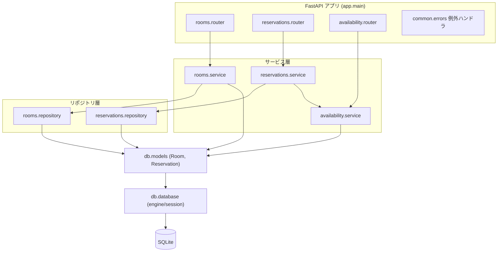
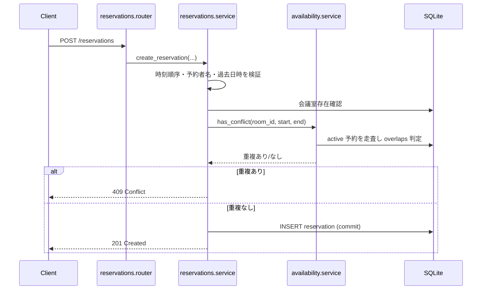

# System Architecture

## System Overview

Python + FastAPI + SQLAlchemy(2.0) + SQLite で実装された単一プロセスの REST API。レイヤードアーキテクチャ（Router → Service → Repository → ORM Model）を機能モジュール（rooms / reservations / availability）ごとに縦割りで構成する。ドメイン例外を HTTP ステータスへ変換する共通ハンドラを持つ。

## Architecture Diagram

## Component Descriptions

### app.main
- **Purpose**: アプリ生成とルータ/例外ハンドラ登録、起動時テーブル作成。
- **Responsibilities**: `create_app()`、`/health`、`create_all()` の呼び出し。
- **Dependencies**: 各 router、common.errors、db.database。
- **Type**: Application

### rooms / reservations / availability（各モジュール）
- **Purpose**: それぞれ会議室・予約・空き検索の機能を提供。
- **Responsibilities**: router（HTTP 入出力）→ service（業務ルール）→ repository（永続化）の3層。availability は repository を持たず service が直接 ORM を照会。
- **Dependencies**: db.models、db.database、common.exceptions。reservations.service は availability.service に依存。
- **Type**: Application

### db.models / db.database
- **Purpose**: ORM モデル定義と SQLAlchemy エンジン/セッション管理。
- **Responsibilities**: Room・Reservation の定義、`get_db` 依存性、`create_all`。
- **Type**: Application (Data)

### common.exceptions / common.errors
- **Purpose**: ドメイン例外定義と HTTP マッピング。
- **Responsibilities**: `ValidationError`→400、`NotFoundError`→404、`ConflictError`→409。
- **Type**: Application (Cross-cutting)

## Data Flow

予約作成（BT-03）の主要フロー:

## Integration Points
- **External APIs**: なし。
- **Databases**: SQLite（`reservations.db`、環境変数 `DATABASE_URL` で差し替え可）。
- **Third-party Services**: なし。

## Infrastructure Components
- **CDK Stacks**: なし。
- **Deployment Model**: `uvicorn app.main:app` によるローカル単一プロセス実行。
- **Networking**: 127.0.0.1:8000（既定、環境変数で変更可）。
