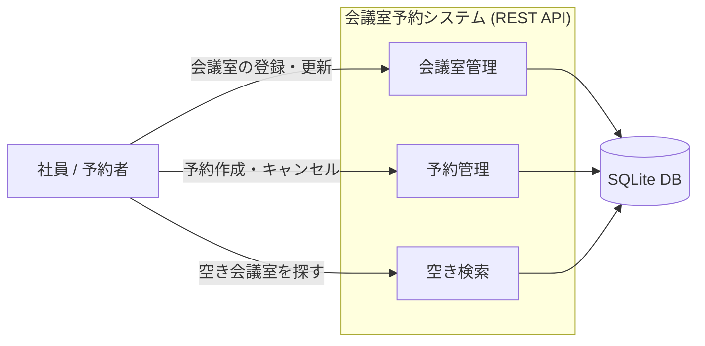

# Business Overview

## Business Context Diagram

## Business Description

- **Business Description**: 社内の会議室を登録・管理し、社員が特定の時間帯に会議室を予約できる REST API。中核の価値は「ダブルブッキングの防止」で、同一会議室・重なる時間帯の予約を拒否する。フロントエンドは持たず、API と Swagger UI のみで完結する。
- **Business Transactions**:
  - **BT-01 会議室登録**: 名前・収容人数・設備・場所を持つ会議室を登録する。
  - **BT-02 会議室更新／削除**: 会議室情報を更新、または有効な予約がない会議室を削除する。
  - **BT-03 予約作成**: 会議室・時間帯・予約者を指定して予約する。重複時は拒否（409）。
  - **BT-04 予約キャンセル**: 予約を取り消す（冪等）。取り消し後の時間帯は再予約可能。
  - **BT-05 予約照会**: 予約の一覧・詳細を取得する（会議室・期間で絞り込み）。
  - **BT-06 空き会議室検索**: 指定時間帯に予約が重ならない会議室を検索する。
- **Business Dictionary**:
  - **会議室 (Room)**: 予約対象の物理リソース。
  - **予約 (Reservation)**: ある会議室の半開区間 `[start, end)` の占有。状態は active / cancelled。
  - **半開区間 (Half-open interval)**: `[start, end)`。終端は含まない。隣接（前予約の end == 次予約の start）は重複と見なさない。
  - **ダブルブッキング**: 同一会議室で時間帯が重なる複数の active 予約が存在する状態。システムはこれを防止する。
  - **重複 (Overlap)**: `start_a < end_b かつ start_b < end_a` を満たす関係。

## Component Level Business Descriptions

### rooms（会議室管理）
- **Purpose**: 会議室マスタの CRUD を提供する。
- **Responsibilities**: 会議室の登録・取得・一覧・更新・削除。名前必須・収容人数0以上の検証。有効予約がある会議室の削除拒否。

### reservations（予約管理）
- **Purpose**: 予約のライフサイクル（作成・照会・キャンセル）を管理する。
- **Responsibilities**: 予約作成時の入力検証（時刻順序・予約者名・過去日時）、会議室存在確認、重複チェックを経た予約登録、冪等なキャンセル。

### availability（空き状況・重複判定）
- **Purpose**: 予約の中核ロジックである重複判定と空き会議室検索を担う。
- **Responsibilities**: 半開区間による重複判定（`overlaps`）、指定会議室の重複有無判定（`has_conflict`）、空き会議室一覧の算出。
