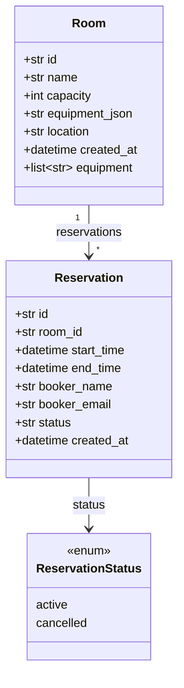

# Code Structure

## Build System
- **Type**: pip（`requirements.txt`）。ビルドツール・パッケージング設定（pyproject.toml 等）はなし。
- **Configuration**: `requirements.txt` に fastapi / uvicorn[standard] / sqlalchemy>=2.0 / pydantic>=2.0 / pytest / httpx。

## Key Classes/Modules

### Existing Files Inventory
（ブラウンフィールドで変更候補となる既存ソース）

- `app/main.py` - FastAPI アプリ生成、ルータ/例外ハンドラ登録、起動時テーブル作成。
- `app/core/config.py` - 環境変数ベースの設定（DATABASE_URL / HOST / PORT）。
- `app/common/exceptions.py` - ドメイン例外（DomainError / NotFoundError / ConflictError / ValidationError）。
- `app/common/errors.py` - ドメイン例外→HTTP ステータスのハンドラ登録。
- `app/db/database.py` - engine / SessionLocal / Base / get_db / create_all。
- `app/db/models.py` - ORM モデル（Room, Reservation, ReservationStatus）とインデックス。
- `app/rooms/router.py` - `/rooms` エンドポイント（CRUD）。
- `app/rooms/service.py` - 会議室ユースケース、削除時の有効予約チェック。
- `app/rooms/schemas.py` - RoomCreate / RoomUpdate / RoomOut。
- `app/rooms/repository.py` - Room の永続化アクセス。
- `app/reservations/router.py` - `/reservations` エンドポイント。
- `app/reservations/service.py` - 予約ユースケース（検証→重複チェック→登録、キャンセル）。
- `app/reservations/schemas.py` - ReservationCreate / ReservationOut。
- `app/reservations/repository.py` - Reservation の永続化アクセス（list に半開区間の期間フィルタ）。
- `app/availability/router.py` - `/availability` エンドポイント。
- `app/availability/service.py` - **中核**: `overlaps` 純粋関数、`has_conflict`、`find_available_rooms`。
- `app/availability/schemas.py` - AvailableRoomsOut。
- `tests/conftest.py` - テスト用一時 SQLite と get_db 差し替え、`create_room` ヘルパー。
- `tests/test_overlaps.py` - `overlaps` の境界条件（隣接OK・一致/内包/部分重なりNG）。
- `tests/test_rooms_api.py` - 会議室 API テスト。
- `tests/test_reservations_api.py` - 予約 API テスト（重複防止中心）。
- `tests/test_availability_api.py` - 空き検索 API テスト。

## Design Patterns

### レイヤードアーキテクチャ（Router / Service / Repository）
- **Location**: 各機能モジュール（rooms, reservations）。
- **Purpose**: HTTP 層と業務ロジックと永続化の分離。
- **Implementation**: router が Pydantic スキーマで入出力、service がドメイン例外を送出、repository が SQLAlchemy Session をラップ。

### ドメイン例外→HTTP マッピング
- **Location**: common.exceptions + common.errors。
- **Purpose**: 業務エラーを HTTP ステータスへ一元変換し、service 層を HTTP 非依存に保つ。
- **Implementation**: FastAPI の `exception_handler` で 400/404/409 を返す。

### 純粋関数による重複判定
- **Location**: `app/availability/service.py::overlaps`。
- **Purpose**: 半開区間の重なり判定を副作用なくテスト可能にする。
- **Implementation**: `start_a < end_b and start_b < end_a`。

## Critical Dependencies

### SQLAlchemy (>=2.0)
- **Version**: 2.0 系（`Mapped` / `mapped_column` 記法）。
- **Usage**: ORM モデル、セッション、クエリ全般。
- **Purpose**: 永続化とマッピング。

### FastAPI / Pydantic (>=2.0)
- **Usage**: ルーティング、依存性注入、入出力スキーマ検証。
- **Purpose**: REST API 層とバリデーション（例: capacity の `ge=0` は 422）。
