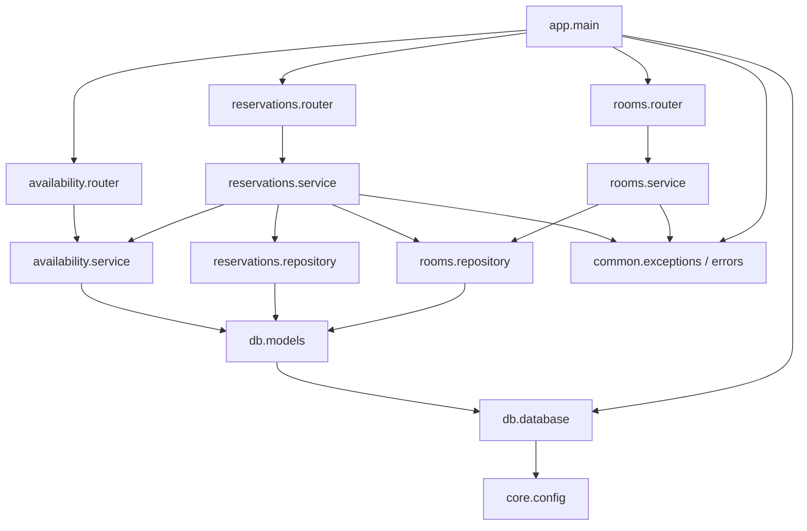

# Dependencies

## Internal Dependencies

### reservations.service depends on availability.service
- **Type**: Runtime
- **Reason**: 予約作成時に `has_conflict` で重複チェックを行うため。

### reservations.service depends on rooms.repository
- **Type**: Runtime
- **Reason**: 予約作成前に対象会議室の存在確認を行うため。

### 各 service depends on common.exceptions
- **Type**: Runtime
- **Reason**: 業務エラーをドメイン例外として送出するため。

### db.database depends on core.config
- **Type**: Runtime
- **Reason**: `DATABASE_URL` 設定からエンジンを生成するため。

## External Dependencies

### fastapi
- **Version**: 未固定（最新）
- **Purpose**: REST API フレームワーク。
- **License**: MIT。

### uvicorn[standard]
- **Version**: 未固定
- **Purpose**: ASGI サーバ。
- **License**: BSD。

### sqlalchemy
- **Version**: >=2.0
- **Purpose**: ORM。
- **License**: MIT。

### pydantic
- **Version**: >=2.0
- **Purpose**: バリデーション/シリアライズ。
- **License**: MIT。

### pytest / httpx
- **Version**: 未固定
- **Purpose**: テスト。
- **License**: MIT / BSD。
