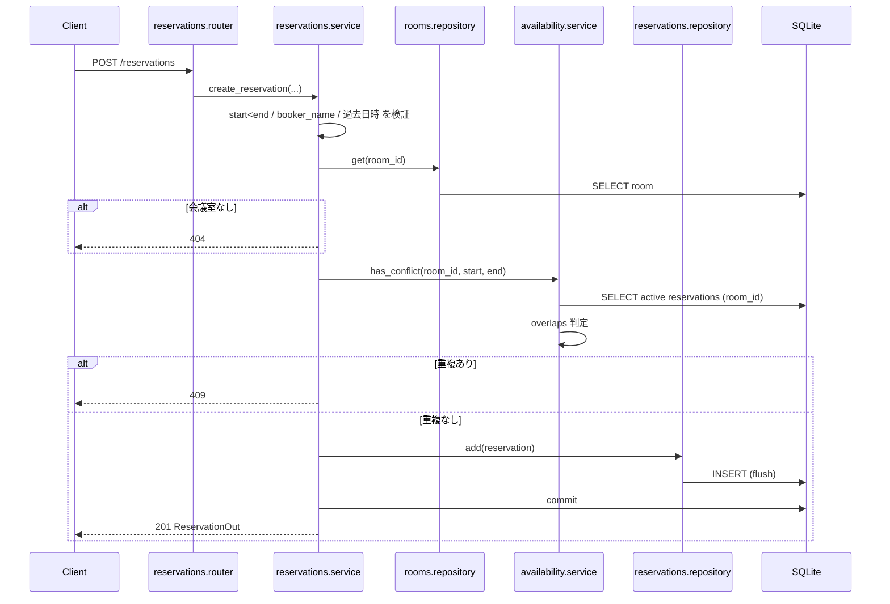
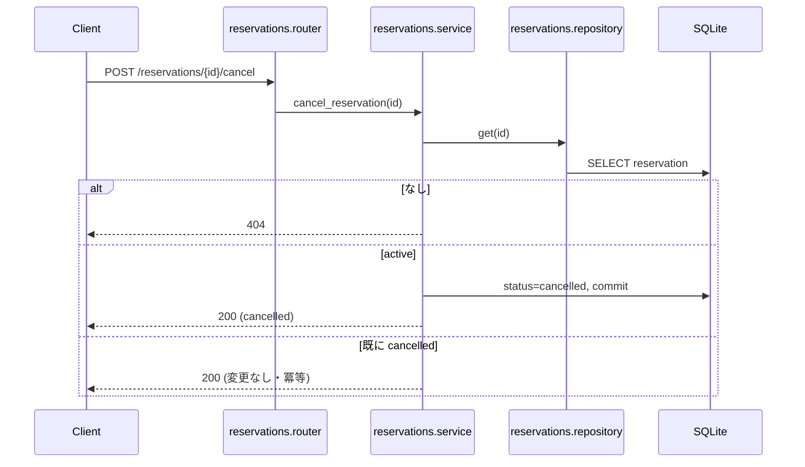
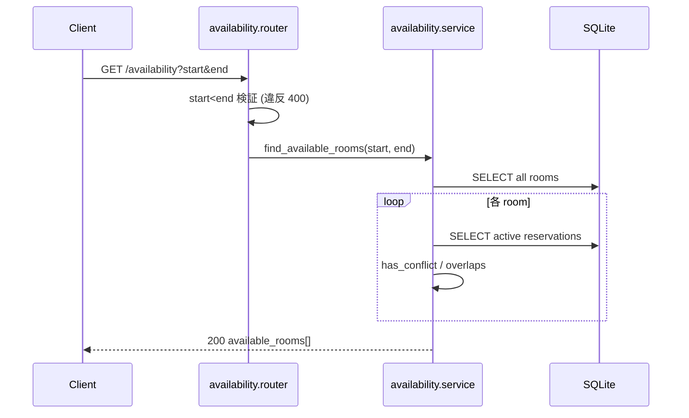

# Interaction Diagrams

ビジネストランザクションがコンポーネント横断でどう実装されるかを示す。

## BT-03 予約作成（重複防止つき）

```mermaid
sequenceDiagram
    participant C as Client
    participant Router as reservations.router
    participant Svc as reservations.service
    participant RoomRepo as rooms.repository
    participant Avail as availability.service
    participant ResRepo as reservations.repository
    participant DB as SQLite

    C->>Router: POST /reservations
    Router->>Svc: create_reservation(...)
    Svc->>Svc: start<end / booker_name / 過去日時 を検証
    Svc->>RoomRepo: get(room_id)
    RoomRepo->>DB: SELECT room
    alt 会議室なし
        Svc-->>C: 404
    end
    Svc->>Avail: has_conflict(room_id, start, end)
    Avail->>DB: SELECT active reservations (room_id)
    Avail->>Avail: overlaps 判定
    alt 重複あり
        Svc-->>C: 409
    else 重複なし
        Svc->>ResRepo: add(reservation)
        ResRepo->>DB: INSERT (flush)
        Svc->>DB: commit
        Svc-->>C: 201 ReservationOut
    end
```

## BT-04 予約キャンセル（冪等）

```mermaid
sequenceDiagram
    participant C as Client
    participant Router as reservations.router
    participant Svc as reservations.service
    participant Repo as reservations.repository
    participant DB as SQLite

    C->>Router: POST /reservations/{id}/cancel
    Router->>Svc: cancel_reservation(id)
    Svc->>Repo: get(id)
    Repo->>DB: SELECT reservation
    alt なし
        Svc-->>C: 404
    else active
        Svc->>DB: status=cancelled, commit
        Svc-->>C: 200 (cancelled)
    else 既に cancelled
        Svc-->>C: 200 (変更なし・冪等)
    end
```

## BT-06 空き会議室検索

```mermaid
sequenceDiagram
    participant C as Client
    participant Router as availability.router
    participant Svc as availability.service
    participant DB as SQLite

    C->>Router: GET /availability?start&end
    Router->>Router: start<end 検証 (違反 400)
    Router->>Svc: find_available_rooms(start, end)
    Svc->>DB: SELECT all rooms
    loop 各 room
        Svc->>DB: SELECT active reservations
        Svc->>Svc: has_conflict / overlaps
    end
    Svc-->>C: 200 available_rooms[]
```
