# Execution Plan — 社内会議室予約システム

## Detailed Analysis Summary

### Change Impact Assessment
- **User-facing changes**: Yes — 社員が使う REST API 一式（会議室・予約・検索）
- **Structural changes**: Yes — 新規アプリの構造をゼロから定義（単一 FastAPI サービス）
- **Data model changes**: Yes — Room / Reservation の新規スキーマ
- **API changes**: Yes — 新規 REST エンドポイント群
- **NFR impact**: Low — ローカル完結、拡張機能すべて無効、性能/セキュリティ要件は最小

### Risk Assessment
- **Risk Level**: Low — 隔離された新規プロジェクト、ロールバック容易（コード削除のみ）
- **Rollback Complexity**: Easy
- **Testing Complexity**: Moderate — 重複防止ロジックの境界条件テストが中心

## Workflow Visualization

### Mermaid Diagram

```mermaid
flowchart TD
    Start(["User Request"])

    subgraph INCEPTION["INCEPTION PHASE"]
        WD["Workspace Detection<br/><b>COMPLETED</b>"]
        RA["Requirements Analysis<br/><b>COMPLETED</b>"]
        US["User Stories<br/><b>COMPLETED</b>"]
        WP["Workflow Planning<br/><b>COMPLETED</b>"]
        AD["Application Design<br/><b>EXECUTE</b>"]
        UG["Units Generation<br/><b>EXECUTE</b>"]
    end

    subgraph CONSTRUCTION["CONSTRUCTION PHASE"]
        FD["Functional Design<br/><b>EXECUTE</b>"]
        NFRA["NFR Requirements<br/><b>EXECUTE</b>"]
        NFRD["NFR Design<br/><b>EXECUTE</b>"]
        ID["Infrastructure Design<br/><b>EXECUTE</b>"]
        CG["Code Generation<br/><b>EXECUTE</b>"]
        BT["Build and Test<br/><b>EXECUTE</b>"]
    end

    subgraph OPERATIONS["OPERATIONS PHASE"]
        OPS["Operations<br/><b>PLACEHOLDER</b>"]
    end

    Start --> WD
    WD --> RA
    RA --> US
    US --> WP
    WP --> AD
    AD --> UG
    UG --> FD
    FD --> NFRA
    NFRA --> NFRD
    NFRD --> ID
    ID --> CG
    CG --> BT
    BT --> OPS
    BT --> End(["Complete"])

    style WD fill:#4CAF50,stroke:#1B5E20,stroke-width:3px,color:#fff
    style RA fill:#4CAF50,stroke:#1B5E20,stroke-width:3px,color:#fff
    style US fill:#4CAF50,stroke:#1B5E20,stroke-width:3px,color:#fff
    style WP fill:#4CAF50,stroke:#1B5E20,stroke-width:3px,color:#fff
    style FD fill:#FFA726,stroke:#E65100,stroke-width:3px,stroke-dasharray: 5 5,color:#000
    style CG fill:#4CAF50,stroke:#1B5E20,stroke-width:3px,color:#fff
    style BT fill:#4CAF50,stroke:#1B5E20,stroke-width:3px,color:#fff
    style AD fill:#FFA726,stroke:#E65100,stroke-width:3px,stroke-dasharray: 5 5,color:#000
    style UG fill:#FFA726,stroke:#E65100,stroke-width:3px,stroke-dasharray: 5 5,color:#000
    style NFRA fill:#FFA726,stroke:#E65100,stroke-width:3px,stroke-dasharray: 5 5,color:#000
    style NFRD fill:#FFA726,stroke:#E65100,stroke-width:3px,stroke-dasharray: 5 5,color:#000
    style ID fill:#FFA726,stroke:#E65100,stroke-width:3px,stroke-dasharray: 5 5,color:#000
    style OPS fill:#FFF59D,stroke:#F57F17,stroke-width:2px,stroke-dasharray: 5 5,color:#000
    style INCEPTION fill:#BBDEFB,stroke:#1565C0,stroke-width:3px,color:#000
    style CONSTRUCTION fill:#C8E6C9,stroke:#2E7D32,stroke-width:3px,color:#000
    style OPERATIONS fill:#FFF59D,stroke:#F57F17,stroke-width:3px,color:#000
    style Start fill:#CE93D8,stroke:#6A1B9A,stroke-width:3px,color:#000
    style End fill:#CE93D8,stroke:#6A1B9A,stroke-width:3px,color:#000

    linkStyle default stroke:#333,stroke-width:2px
```



### Text Alternative

```
INCEPTION PHASE
- Workspace Detection ....... COMPLETED
- Requirements Analysis ..... COMPLETED
- User Stories .............. COMPLETED
- Workflow Planning ......... COMPLETED (current)
- Application Design ........ EXECUTE
- Units Generation ......... EXECUTE

CONSTRUCTION PHASE
- Functional Design ........ EXECUTE
- NFR Requirements ......... EXECUTE
- NFR Design ............... EXECUTE
- Infrastructure Design .... EXECUTE
- Code Generation .......... EXECUTE
- Build and Test ........... EXECUTE

OPERATIONS PHASE
- Operations ............... PLACEHOLDER
```

## Phases to Execute

### 🔵 INCEPTION PHASE
- [x] Workspace Detection (COMPLETED)
- [x] Reverse Engineering (SKIPPED — greenfield)
- [x] Requirements Analysis (COMPLETED)
- [x] User Stories (COMPLETED)
- [x] Execution Plan (IN PROGRESS)
- [ ] Application Design - **EXECUTE**
  - **Rationale**: （ワークショップ方針: 全工程を体験）Room / Reservation コンポーネントの責務・メソッド・依存関係・サービス層を明示的に設計する。
- [ ] Units Generation - **EXECUTE**
  - **Rationale**: （ワークショップ方針: 全工程を体験）単一ユニットになる見込みだが、ユニット分解の工程を体験するため実行する。
    実質 1 ユニット（会議室予約サービス）として定義する。

### 🟢 CONSTRUCTION PHASE
- [ ] Functional Design - **EXECUTE**
  - **Rationale**: 新規データモデル（Room / Reservation）と中核の業務ロジック（重複判定の境界条件）を確定する必要がある。ワークショップの品質の要。
- [ ] NFR Requirements - **EXECUTE**
  - **Rationale**: （ワークショップ方針: 全工程を体験）性能・セキュリティ・スケール等の観点を軽く洗い出し、確定済みのローカル技術スタック前提を明文化する。
- [ ] NFR Design - **EXECUTE**
  - **Rationale**: NFR Requirements で挙げた観点への対処パターン（入力検証、DB制約による重複防止、エラーハンドリング等）を設計に反映する。
- [ ] Infrastructure Design - **EXECUTE**
  - **Rationale**: ローカル実行環境（uvicorn プロセス、SQLite ファイル、起動方法）を軽くマッピングする。クラウド資源は対象外。
- [ ] Code Generation - **EXECUTE (ALWAYS)**
  - **Rationale**: 実装計画とコード生成が必要。
- [ ] Build and Test - **EXECUTE (ALWAYS)**
  - **Rationale**: ビルド・テスト・検証（特に重複防止の境界テスト）が必要。

### 🟡 OPERATIONS PHASE
- [ ] Operations - **PLACEHOLDER**

## Estimated Timeline
- **Total Stages to Execute (残り)**: 8（Application Design → Units Generation → Functional Design → NFR Requirements → NFR Design → Infrastructure Design → Code Generation → Build and Test）
- **Estimated Duration**: 2〜3時間（ワークショップ範囲。各設計工程は軽量な深さで実施し、時間内に収める）
- **Note**: ユーザー希望により全工程を EXECUTE（ワークショップとして各段階を体験する目的）。小規模プロジェクトのため各設計工程は Minimal〜Standard の深さで進める。

## Success Criteria
- **Primary Goal**: ダブルブッキングを機械的に防止する会議室予約 REST API を完成させる
- **Key Deliverables**:
  - FastAPI アプリ（会議室 CRUD、予約作成/一覧/取得/キャンセル、空き検索）
  - SQLite による永続化
  - 重複防止ロジックと、その境界条件をカバーする自動テスト
- **Quality Gates**:
  - US-05 の受け入れ基準（半開区間・隣接OK・重なり409）をテストで検証
  - すべてのエンドポイントが Swagger UI から実行可能
